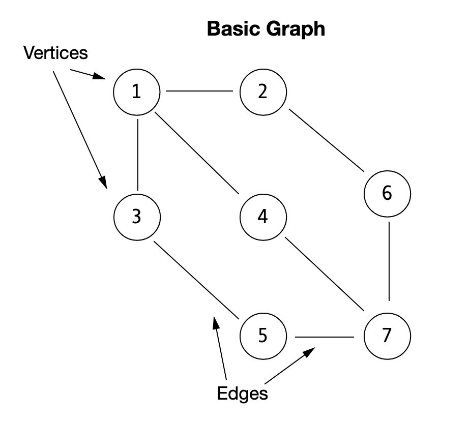
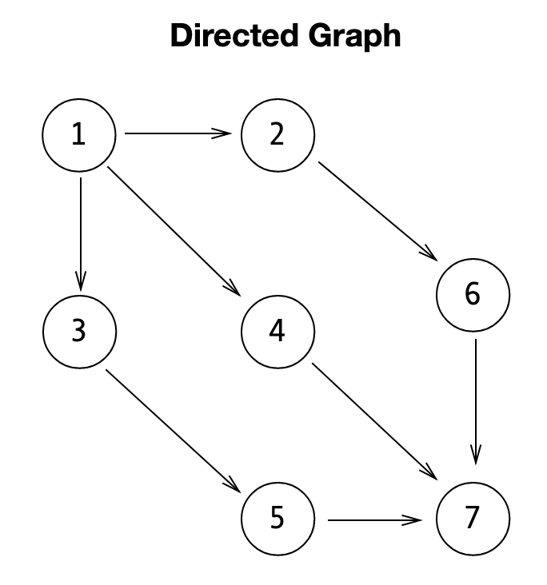
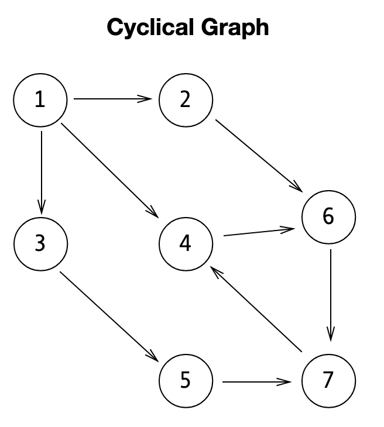
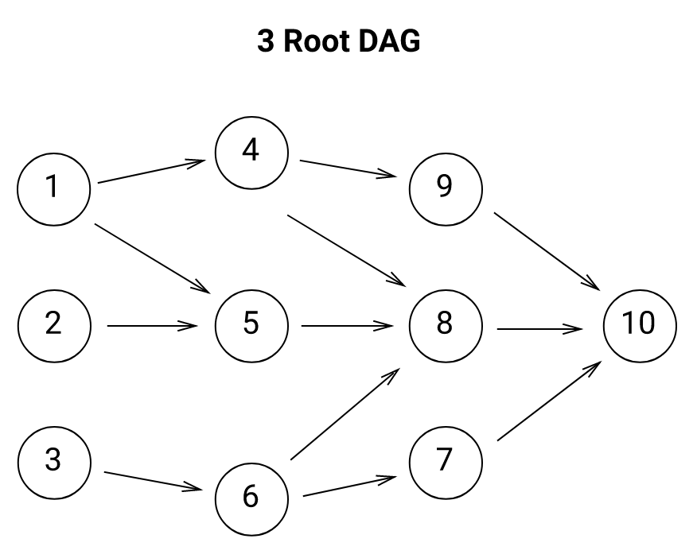

## Multidependency Pipeline
In the last notebook, we created the pipeline that can handle our tasks. This pipeline class was limiting though because it could only handle a linear ordering of tasks. In reality tasks are not always going to be linear therefore, we need to alter our pipeline that can handle multiple branches of dependencies. To do this we can use whats called a Directed Acyclic Graph, or DAG. 

A DAG can be described in terms of a tree. The **graph** part of the tree is made of a series of verticies (nodes) and edges (branches). 




**Directed** says that each of the edges points in one direction.




Last, **Acyclic** says the graph does not have any cycles. 
The image below is an example of a graph with a cycle.




## DAG
For refrence, the sencond image in the notebook holds the requirements of a DAG. First, there are a series of verticies and edges, second, each task has a direction, and third, there are no cycles. You can see this in the re-printed image below.


The DAG structure was built to naturally crate and **efficient** ordering of dependent tasks. Using a DAG scheduler allows us to implement schedueling in **linear** time, such that **O(V + E)**, where **V** and **E**  are the amount of verticies and edges.

Another things to remember is that unlike the last pipeline, a graph structure will **not** always start with a single root node. For example, the image below shows us a 3 root DAG.


The behavior we are looking for is to be able to link verticies to multiple nodes in a graph. We then need to be able easily loop through nodes to create the graph. In Python, this can be done using a dict with list values. 

Example...


```python
graph = {
    7: [],
    6: [7],
    5: [7],
    4: [7],
    3: [5],
    2: [6],
    1: [2, 3, 4]
}
```

In the code above, we can see that each indice describes a task that was added to the dict. While each list contains the indice number that each task is dependent on. Our first number, 7, is our root node and is not reliant on other task. 

If we want to implement this as a method in our class, we will need to have the script look at the dict each time and determine if that task has been inserted yet. If a task hasn't been inserted into the dict the script will place it in the dict with an empty list as its value. If the task was just added, or has already been added previously, the script will append any values that have been placed as an argument in the "to" parameter into the specified tasks list.

An example of a class containing a method that does that is as follows...


```python
class DAG():
    ## When a vaiarable is created with the DAG class 
    # it will begin by initializing itself as an empty dict
    def __init__(self):
        self.graph = {}
    
    ## Our add method checks to see if a task (node) has been inserted into the dict yet 
    # and adds it if the node cannot be found it adds it to the dict.
    ## When the task (node) is found, or added to the dict, the add method will then append any dependent 
    # tasks that have been specified in the "to" parameter into the list for that task (node).
    def add(self, node, to=None):
        if not node in self.graph:
            self.graph[node] = []
        if to:
            if not to in self.graph:
                self.graph[to] = []
            self.graph[node].append(to)
```

Now that we have our DAG class set up with an add method we can simply create and a tasks and their dependencies to graph object in a variable created with the DAG class. 

Example...


```python
dag = DAG()
dag.add(1)
dag.add(1, 2)
dag.add(1, 3)
dag.add(1, 4)
dag.add(3, 5)
dag.add(2, 6)
dag.add(4, 7)
dag.add(5, 7)
dag.add(6, 7)
```

## DAG Sorting

Our use case for the DAG was to create a pipeline that allows us to place tasks in order of dependencies. Where we start with the most depended on task at the top and we end with the least depended on. I.e. in our pipeline, we begin by parsing a file, and end by summarizing.

In our original DAG graph, node 1 is the most depended on and each of the nodes along the path decrease in importance. We can also think of it as the longer the path to the node, the less that node is depended on.


With this hypothesis, can can do the following:
1. Find the "root" nodes of the graph with 0 dependencies
2. For each node, find the longest path from the node to the roots
3. Sort by the longest paths

This process comes with some time complexity drawbacks. Such as, for 2 and 3 the time complexities for each are $O(n^2)$ (longest path) and $O(nlog n)$ (fastest sort) respectively. Our worst case is then $O(n^2)$.

In order to implement our sorting algorithm to find the longest path it's necessary to know which nodes "start" the directed graph. Start in this scenario context refers to the root node that the graph expands from. As you can see below, the 3 root dag has three root nodes.


To determine whhich nodes we can considered to be root nodes we must think about the number of *in-degrees* a node contains. **in-degrees** can be described as the total count of edges pointing **towards** the node. For example, in the graph above we can see node five has two in-degrees, and node eight has three in-degrees, but each root node will always have zero in-degrees.

Therefore, to figure out which nodes are root nodes, we can count how many times the nodes refer to each other and then filter out the rows that have an in-degrees larger then zero. Our DAG class will then look as such...


```python
class DAG():
    def __init__(self):
        self.graph = {}
        
    def add(self, node, to=None):
        if not node in self.graph:
            self.graph[node] = []
        if to:
            if not to in self.graph:
                self.graph[to] = []
            self.graph[node].append(to)              
                
    def in_degrees(self):
        self.degrees = {}
        for node in self.graph:
            if node not in self.degrees:
                self.degrees[node] = 0
            for pointed in self.graph[node]:
                if pointed not in self.degrees:
                    self.degrees[pointed] = 0
                self.degrees[pointed] += 1
```

our "in-degrees" method works to create a dictionary of the amount of in-degrees 
that each task has. First, the method creates a degrees object that is assigned a dict.

Second, the method then proceeds to loop over each of the nodes in the graph object. 
If the node being refrered to from the grap dict is not in the degrees dict the first if statement will add the node to the degree dict and give it an indegrees on 0 to begin. 
Once the node has been added, the same loop will then begin a for loop to look at each node in the list for the node the previous for loop is currently analyzing. 

If the node does not appear in our self.degrees dict, the will add the node to the degrees dict. (this is a fail safe incase a node slipped passed the first if statement) If the node is identified to be present in the degrees dict, it will add one to the count its in-degrees count.

The method abovce can be used as such...


```python
dag = DAG()
dag.add(1)
dag.add(1, 2)
dag.add(1, 3)
dag.add(1, 4)
dag.add(3, 5)
dag.add(2, 6)
dag.add(4, 7)
dag.add(5, 7)
dag.add(6, 7)
dag.in_degrees()
```

## Walk
Once we have the in-degreees of each node we are then able to implement the **walk** part of our DAG. To start this we can begin by filtering out our root nodes. Remember, our root nodes have 0 in-degrees. We can filter it out as such...

```
root_nodes = []
for node in in_degrees: 
    if in_degrees[node] == 0:
        root_nodes.append(node)
```

Our initial hypothesis, was that the shorter the path, the more a node is depended on. Therefore, our root nodes are objectivley the most important nodes in our tree. Based on this hypothesis, we should  then do the following:
1. Filter all the root nodes, and pop them off the graph.
2. Search their pointers, and check if they are the new root nodes.
  1. If one is, append it to the root nodes list, and pop it off the graph.
  2. If not, then continue.
3. Once all the nodes have been popped from the graph, return the list of ordered root nodes.

This algorithm allows us to order nodes in order of importance in a systematic way. As a code solution, we can write this using a queue:

1. Using *in_degrees*, place the root node(s) in a queue.
2. while the queue is **not** empty:
  1. Deque a node, *node_i*
  2. Check each of the pointers in the node.
  3. Decrement the pointer's *in_degrees* by 1 (reduce pointers).
  4. If that pointer's # of in-degrees is 0, add it to the queue
  5. If not, continue.
  6. Once all the pointers have been searched, append *node_i* to the list *searched*.
  7. Continue the while loop.
3. return the *searched* list.

We will write it in the sort class as a *sort()* method as such...

```
from collections import deque()

def sort(self):
    self.in_degrees()
    to_visit = deque()
    
    ## This loops through the graph object and pulls root nodes into 
    # a double ended que object for memory efficient appends and pops
    for node in self.graph:
        if self.degrees[node] == 0:
            to_visit.append(node)
            
     ## Searched is our list that will contain our sorted elements
     searched = []
     while to_visit:
         # the first line in our while loop removes a node from the deque objects list
         node = to_visit.popleft()
         ## our for loop goes through every pointer in the node and 
         # subtracts one from the degrees. when the pointer has a degrees 
         # of zero it adds it the the que to be appended to our search list
         for pointer in self.graph[node]:
             self.degrees[pointer] -= 1
             if self.degrees[pointer] == 0
                 to_visit.append(pointer)
             # this line adds the node to the searched line
             searched.append(node)
     return searched
```

Let's go ahead and insert this into our DAG class...


```python
from collections import deque
class DAG():
    def __init__(self):
        self.graph = {}
        
    def add(self, node, to=None):
        if not node in self.graph:
            self.graph[node] = []
        if to:
            if not to in self.graph:
                self.graph[to] = []
            self.graph[node].append(to)              
                
    def in_degrees(self):
        self.degrees = {}
        for node in self.graph:
            if node not in self.degrees:
                self.degrees[node] = 0
            for pointed in self.graph[node]:
                if pointed not in self.degrees:
                    self.degrees[pointed] = 0
                self.degrees[pointed] += 1
                
    def sort(self):
        self.in_degrees()
        to_visit = deque()
        
        for node in self.graph:
            if self.degrees[node] == 0:
                to_visit.append(node)
        
        searched = []
        while to_visit:
            node = to_visit.popleft()
            
            for pointer in self.graph[node]:
                self.degrees[pointer] -= 1
                if self.degrees[pointer] == 0:
                    to_visit.append(pointer)
            searched.append(node)
        return searched
```

With the *sort*  method inserted into our DAG class, we can now apply the algorithm as such...


```python
dag = DAG()
dag.add(1)
dag.add(1, 2)
dag.add(1, 3)
dag.add(1, 4)
dag.add(3, 5)
dag.add(2, 6)
dag.add(4, 7)
dag.add(5, 7)
dag.add(6, 7)
dependencies = dag.sort()

graph = dag.graph
graph_str = ', '.join("{!s}={!r}".format(key,val) for (key,val) in graph.items())
print("Original graph:")
print("    "+str(graph)+"\n")
print("Graph sorted on dependencies:")
print("    "+str(dependencies))
```

    Original graph:
        {1: [2, 3, 4], 2: [6], 3: [5], 4: [7], 5: [7], 6: [7], 7: []}
    
    Graph sorted on dependencies:
        [1, 2, 3, 4, 6, 5, 7]


We call this algorithm a [**topological sort**](https://en.wikipedia.org/wiki/Topological_sorting), specifically of the topological algorithm we ran is called [Kahn's Algorithm](https://en.wikipedia.org/wiki/Topological_sorting#Kahn's_algorithm) which is a  famous DAG algorithm. Kahn's algorithm works by choosing vertices in the same order as the eventual topological sort. Additionaly, **Kahn's Algorithm** can help us determine whether a graph is acylical, or not. 

To test for cyclicity:
1. first sort our DAG 
2. return the topologically sorted list of nodes
3. then we check the length of the sorted nodes

*If the length of the topologically sorted nodes is greater than the amount of nodes in the graph, then there must be a cycle.* 

This is because, since a topological sort visits all pointed nodes, a graph with a cycyle will cause Kahn's Algorithm to analyze a node that has already been viewed. The nature of Kahn's Algorithm is then influenced by the graph to create a topologically sorted list that is longer than the number of vertices in the graph.

In our code, we can add this level of quality assurance to our algorithm by adding a simple length check in our add method...
```
if len(self.sort()) != len(self.graph):
            raise Exception
```
Simply put, if the length of our sorted graph is longer then  the length of our graph, than we will raise an exception.

Lets add this to our DAG.


```python
from collections import deque
class DAG():
    def __init__(self):
        self.graph = {}
        
    def add(self, node, to=None):
        if not node in self.graph:
            self.graph[node] = []
        if to:
            if not to in self.graph:
                self.graph[to] = []
            self.graph[node].append(to)    
        if len(self.sort()) != len(self.graph):
            raise Exception
                
    def in_degrees(self):
        self.degrees = {}
        for node in self.graph:
            if node not in self.degrees:
                self.degrees[node] = 0
            for pointed in self.graph[node]:
                if pointed not in self.degrees:
                    self.degrees[pointed] = 0
                self.degrees[pointed] += 1
                
    def sort(self):
        self.in_degrees()
        to_visit = deque()
        
        for node in self.graph:
            if self.degrees[node] == 0:
                to_visit.append(node)
        
        searched = []
        while to_visit:
            node = to_visit.popleft()
            
            for pointer in self.graph[node]:
                self.degrees[pointer] -= 1
                if self.degrees[pointer] == 0:
                    to_visit.append(pointer)
            searched.append(node)
        return searched
```

With our cycle filter added to our add methods we can now test the DAG.


```python
dag = DAG()
dag.add(1)
dag.add(1, 2)
dag.add(1, 3)
dag.add(1, 4)
dag.add(3, 5)
dag.add(2, 6)
dag.add(4, 7)
dag.add(5, 7)
dag.add(6, 7)
# Add a pointer from 7 to 4, causing a cycle.
dag.add(7, 4)
```


    ---------------------------------------------------------------------------

    Exception                                 Traceback (most recent call last)

    <ipython-input-47-e9c94b4cfa42> in <module>
         10 dag.add(6, 7)
         11 # Add a pointer from 7 to 4, causing a cycle.
    ---> 12 dag.add(7, 4)
    

    <ipython-input-46-5724c9dd3be1> in add(self, node, to)
         12             self.graph[node].append(to)
         13         if len(self.sort()) != len(self.graph):
    ---> 14             raise Exception
         15 
         16     def in_degrees(self):


    Exception: 


We now have a robust DAG class that can be used as a scheduler in our pipeline. Now all we need to do is simply add the *DAG* class to our *Pipeline* class. By converting our *tasks* list property to a *DAG*, we can have the *DAG.task* method add tasks to the *self.tasks.graph* object. 

Our *Pipeline* class now looks like...


```python
class Pipeline():
    def __init__(self):
        self.tasks = DAG()
        
    def task(self, depends_on=None):
        def inner(f):
            self.tasks.add(f)
            if depends_on:
                self.tasks.add(depends_on, f)
            return f
        return inner
```

As you can see, our pipeline now creates a *DAG* object upon initialization and assigns it to the *self.tasks* variable. Additionally, we put in a check in our *task* method to check if the user included any dependencies that need to be assigned to that node as well. 

We can now test out the new pipeline...


```python
pipeline = Pipeline()
@pipeline.task()
def first():
    return 20

@pipeline.task(depends_on=first)
def second(x):
    return x * 2

@pipeline.task(depends_on=second)
def third(x):
    return x // 3

@pipeline.task(depends_on=second)
def fourth(x):
    return x // 4

grph = pipeline.tasks.graph
```

if we print the output of our graph variable, we can see we have a graph and their various dependencies. 


```python
print(grph)
```

The obvious next step then would be to run the pipeline. The behavior we would like to create for our *run* method looks like...
```
pipeline = Pipeline()

@pipeline.task()
def first():
    return 20

@pipeline.task(depends_on=first)
def second(x):
    return x * 2

@pipeline.task(depends_on=second)
def third(x):
    return x // 3

@pipeline.task(depends_on=second)
def fourth(x):
    return x // 4

outputs = pipeline.run()
```
Note, there are no inputs for the *run* method, to run our pipeline we create a task to return a static object. 

Additionally, DAG also has no concept of a *last task*, in order to represent tasks and their outputs during a run we can use a dictionary that maps *(function: output)*. This will allow us to store outputs after a task completes so we can use them as inputs for the next task who requires them. 

To achieve this behavior we can write our *run* method in our pipeline as such...


```python
class Pipeline():
    def __init__(self):
        self.tasks = DAG()
        
    def task(self, depends_on=None):
        def inner(f):
            self.tasks.add(f)
            if depends_on:
                self.tasks.add(depends_on, f)
            return f
        return inner
    
    def run(self):
        scheduled = self.tasks.sort()
        completed = {}
        
        for task in scheduled:
            for node, values in self.tasks.graph.items():
                if task in values:
                    completed[task] = task(completed[node])
            if task not in completed:
                completed[task] = task()
        return completed
```

As you can see, we use the sort method from our *DAG* class to communicate to the *run* method the order in which to call each function. 

We can also see in the *for* loop that each iteration another for loop looks at the first pointer that tasks has and *if* the task lised is found to be in *items* for that node the statement will call that function with the previous tasks out and assign it a place in the *completed* dictionary. 

If the task has not been placed in completed it will run the task with no input.


```python
pipeline = Pipeline()

@pipeline.task()
def first():
    return 20

@pipeline.task(depends_on=first)
def second(x):
    return x * 2

@pipeline.task(depends_on=second)
def third(x):
    return x // 3

@pipeline.task(depends_on=second)
def fourth(x):
    return x // 4

output = pipeline.run()
output
```

We now have a pipeline that is not dependent on a linear dependency mapping. Our use of the DAG as a task scheduler lets us add tasks to be ran in a sorted our based on the dependencies we specify using the *depends_on* parameter.

It is not perfect, but it can by all means be used in live scenarios if need be. 


```python

```


```python

```
